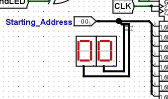
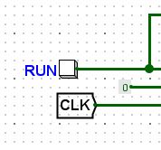
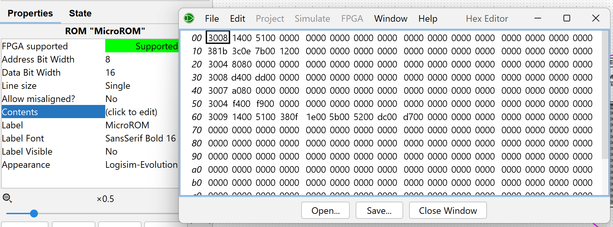

# 7-bit-CPU

The project is a programmable 7-bit CPU with four 7-bit general purpose registers;
R1, R2, R3, and R4 and one special-purpose register; Rx all designed with Logisim.

## Features

The 7-bit programmable CPU architecture includes:

- An ALU to execute the required instructions (refer to Table 2)
- A data path with 7-bit general-purpose registers; R1 to R4
- One Special-purpose register which contains the 7-bits data and the Parity bit as set by the code
- A special-purpose register; Rx (more details are given later)
- A micro-programmed Control Unit with a 2^8 x 16 bits addressable ROM
- The Program Counter stops once all the instructions of a program are executed.
- A RUN button to start program execution.
- An END LED to indicate program termination.
- A display unit to each register to show its contents

## Setup and Usage

1. If not done, Install Logisim-Evolution ([Logisim Installation Guide](https://github.com/logisim-evolution/logisim-evolution)).

2. Clone the repository using the code below in the terminal or use GitHub Desktop.
    ```bash
    git clone https://github.com/fahrel-fh2206836/7-bit-cpu.git
    ```

3. Launch Logisim and Open the file: **_Logisim/Project.circ_**

4. Set a Starting Address in Hex of an Existing Program (Check the file **_Program-Examples.xlsx_**)

    

5. Click the **RUN** Button.

    

6. Create your own program by clicking on the Micro-ROM then edit its content. Refer to **_Project-Documentation.docx_** for the Instruction Set and Format. (Optional)

    

## More About the Project

You can find:
- More Detailed Objectives of the Project: **_Project-Description.pdf_**
- Project Documentation: **_Project-Documentation.docx_**
- Binary and Hexcode of Program execution examples: **_Program-Examples.xlsx_**


## Contributors

-	Fahrel Azki Hidayat
-	Syed Muhammad Hamza Iqbal 
-	Khalid Haji
-   Mohammed Mansib Shahriyar Alam

